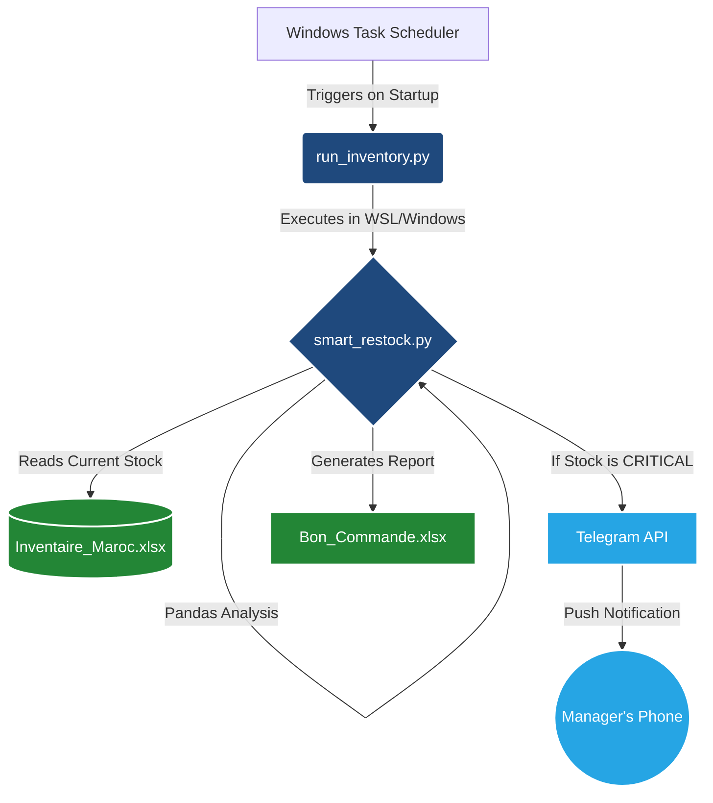

# 🏭 Automated Inventory Manager v2.0 (Python, API & Excel)

 
 


## 📋 Overview
This project is a **Smart Supply Chain Automation** tool designed for SMEs to eliminate manual monitoring.

The system acts as a **"Digital Supervisor"**: it analyzes stock levels via **Pandas**, generates professional **XlsxWriter** reports, and most importantly uses the **Telegram Bot API** to send real-time alerts to managers when stock reaches critical levels.

## 🚀 Key Features
* **📱 Real-Time Telegram Alerts:** Integrates with the Telegram Bot API to push instant notifications for "CRITICAL" stock levels directly to mobile devices.
* **🧠 Automated Decision Logic:** Uses vectorized Pandas operations to calculate re-order quantities and categorize urgency (`CRITICAL` vs. `Priority`).
* **💰 Financial Intelligence:** Automatically calculates total procurement budgets in Moroccan Dirham (DH) for executive review.
* **📊 Professional Reporting:** Programmatically generates formatted `.xlsx` Purchase Orders with conditional formatting, custom borders, and currency symbols.

## 🛠️ Technical Stack
* **Language:** Python 3.12
* **API Integration:** Telegram Bot API (via `requests`)
* **Data Analysis:** Pandas (Vectorization & DataFrames)
* **Reporting:** XlsxWriter
* **Security:** `python-dotenv` for environment variable management

## 📂 Project Structure
| File | Description |
| :--- | :--- |
| `smart_restock.py` | The core engine that analyzes stock and triggers Telegram alerts. |
| `alerts.py` | Modular API handler for sending messages. |
| `run_inventory.py` | Windows wrapper script for seamless WSL & Task Scheduler integration. |
| `generate_inventory.py` | Script to simulate inventory data for testing. |
| `.env.example` | Template for configuring your API keys safely. |
| `requirements.txt` | List of dependencies. |




## ⚙️ Setup & Installation

### 1. Clone the Repository
```bash
git clone (https://github.com/afwalid37-art/Automated-Inventory-Manager.git)
cd Automated-Inventory-Manager
```

### 2. Install Dependencies
```bash
pip install -r requirements.txt
```

### 3. Configure Security (.env)
1. Rename the file `.env.example` to `.env`.
2. Open `.env` and add your Telegram credentials (get them from **@BotFather**):

```ini
TELEGRAM_TOKEN=your_token_here
TELEGRAM_CHAT_ID=your_chat_id_here
```

## 🏃‍♂️ How to Run

**Step 1: Generate Mock Data**
Create a fresh inventory file to test the system.
```bash
python generate_inventory.py
```

**Step 2: Run the Manager**
Analyze the stock and trigger alerts.
```bash
python smart_restock.py
```
*You will see a "✅ Alert sent" confirmation in the terminal and receive a notification on your phone.*

## ⏰ Automated Deployment (Zero-Touch)

This tool is designed to run silently in the background without human intervention. It is configured via **Windows Task Scheduler** to execute automatically on system startup, ensuring managers receive their Telegram alerts and Excel reports the moment they open their laptops.

### Windows Task Scheduler Setup (Production via Wrapper Script)
To make the script run completely hands-free, especially if hosted within a WSL environment:

1. Open **Task Scheduler** in Windows.
2. Create a "Basic Task" (e.g., `Daily_Restock_Alerts`).
3. Set the Trigger to **"At startup"** (Recommendation: Add a 30-second delay to ensure network connectivity).
4. Set the Action to **"Start a program"**.
   * **Program/script:** Point to your Windows Python executable (e.g., `C:\Users\Admin\AppData\Local\Programs\Python\Python312\python.exe`).
   * **Add arguments:** Point to the custom wrapper script (e.g., `C:\Users\Admin\Documents\scripts\run_inventory.py`).
   * **Start in:** Leave blank (The wrapper script natively handles all path routing).

## 📸 Screenshots


---

## 👨‍💻 Author

**El Walid El Alaoui Fels**
*Data Engineer | Microsoft Stack & Automation Specialist*

[LinkedIn Profile](https://www.linkedin.com/in/el-walid-el-alaoui-fels-51491538b/) | [Upwork](https://www.linkedin.com/in/el-walid-el-alaoui-fels-51491538b/)